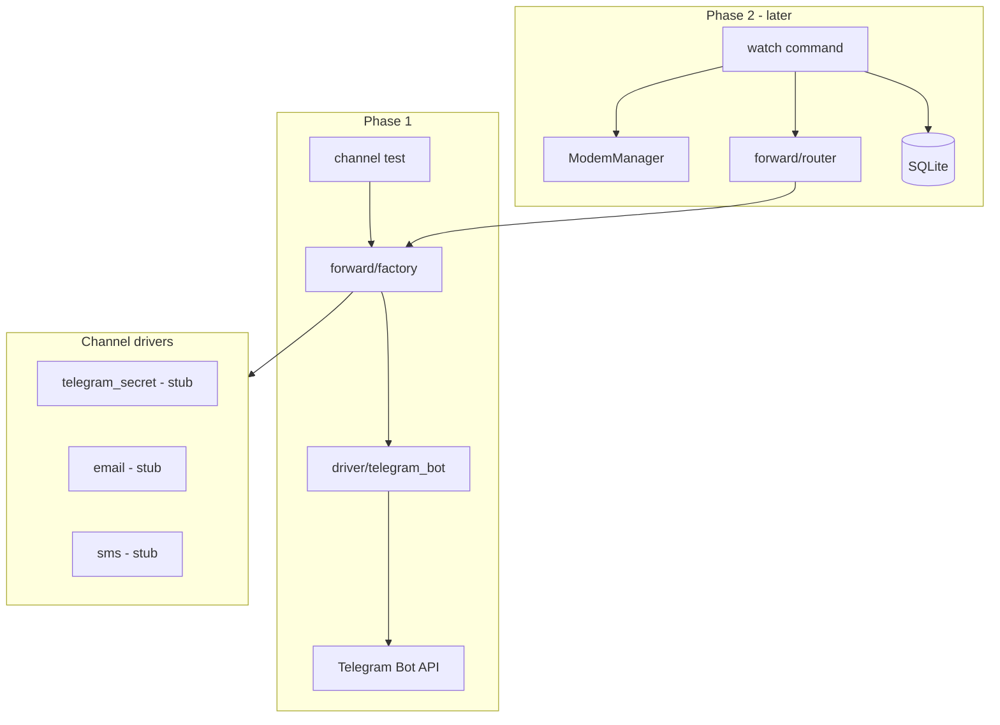

# Forwarding Channels and Routing Rules

## Goal

Build a **pluggable forward-channel layer** (mirroring the existing modem driver pattern in [`internal/factory/factory.go`](internal/factory/factory.go)) so incoming SMS can be routed to one or more destinations via config rules.

**Phase 1 (this iteration):** architecture + config schema + `telegram_bot` driver + **`channel test`** debug command to prove Telegram setup works.

**Later phases:** `watch` daemon, SQLite persistence, MM D-Bus `Added` signal, additional channel drivers.

## Design principles

1. **Symmetry with modem drivers** — `internal/forward.Channel` interface + `internal/forward/factory` selects implementation by `driver` field in config.
2. **Named channels** — reusable destinations (`my-telegram`, `ops-email`, `backup-sms`).
3. **Named modems** — support multiple modems/SIMs; each has its own mm/serial settings.
4. **Declarative rules** — `forward_rules` in YAML: which inbound SMS goes to which channel(s).
5. **Extensibility** — stub unimplemented drivers now; implement later without changing router/CLI shape.

## Architecture



## Channel interface

New package [`internal/forward/channel.go`](internal/forward/channel.go):

```go
// Channel delivers an inbound SMS notification to an external destination.
type Channel interface {
    // Name returns the config key for this channel instance.
    Name() string
    // Driver returns the driver id (telegram_bot, telegram_secret, email, sms).
    Driver() string
    // Ping verifies configuration and connectivity (e.g. Telegram getMe).
    Ping(ctx context.Context) error
    // Forward sends a notification for one inbound SMS.
    Forward(ctx context.Context, msg InboundSMS) error
    Close() error
}

type InboundSMS struct {
    Modem   string // config modem name, e.g. "sim-bank-1"
    ID      string // modem message id
    From    string // sender phone number (E.164 preferred)
    Text    string
    Time    string // display timestamp
}
```

Factory [`internal/forward/factory.go`](internal/forward/factory.go):

| Driver | Phase | Notes |
|--------|-------|-------|
| `telegram_bot` | **1** | Bot API private chat; plaintext on Telegram infra |
| `telegram_secret` | stub | Returns clear "not implemented" error |
| `email` | stub | SMTP forward — future |
| `sms` | stub | Re-send as outbound SMS to configured number — future |

## Routing rules

Router [`internal/forward/router.go`](internal/forward/router.go) — **implemented + unit-tested in phase 1**, used by `watch` in phase 2.

**Matching logic (first rule wins):**

1. Rule `modem` must match inbound `InboundSMS.Modem` (empty `modem` in rule = match any modem).
2. Rule `from` matches sender:
   - exact: `"+79162821457"`
   - wildcard suffix: `"+44*"` (prefix match)
   - catch-all: `"*"`
3. Rule `to` is a list of **channel names** to forward to (fan-out).

```yaml
forward_rules:
  - name: bank-otp
    modem: sim-bank-1
    from: "+79001234567"
    to: [my-telegram]

  - name: uk-numbers-on-sim2
    modem: sim-bank-2
    from: "+44*"
    to: [my-telegram, backup-sms]

  - name: sim1-default
    modem: sim-bank-1
    from: "*"
    to: [my-telegram]
```

If no rule matches → log warning, optionally persist without forward (phase 2).

## Configuration schema

Extend [`internal/config/config.go`](internal/config/config.go) and [`config.example.yaml`](config.example.yaml).

**Backward compatibility:** keep top-level `driver` / `serial` / `mm` for existing CLI (`ping`, `status`, `messages`, `send`). Add optional `default_modem` key pointing into `modems` map; if unset, existing top-level driver settings continue to work.

```yaml
# Existing CLI default modem (unchanged behavior)
driver: mm
mm:
  modem_index: 0
  timeout: 5s

# Optional: named modems for forwarding / multi-SIM (phase 2 watch uses these)
default_modem: ec25-main

modems:
  ec25-main:
    driver: mm
    mm:
      modem_index: 0
      timeout: 5s
  ec25-backup:
    driver: mm
    mm:
      modem_index: 1
      timeout: 5s

channels:
  my-telegram:
    driver: telegram_bot
    telegram:
      bot_token: ""          # use env SMS_GATEWAY_CHANNEL_MY_TELEGRAM_TOKEN or global override
      chat_id: 123456789
      # template optional in phase 2

  backup-sms:
    driver: sms
    sms:
      modem: ec25-backup     # which modem sends the notification SMS
      number: "+1234567890"

  ops-email:
    driver: email
    email:
      smtp_host: smtp.example.com
      to: ops@example.com

forward_rules:
  - name: default
    modem: ec25-main
    from: "*"
    to: [my-telegram]
```

**Secrets via env** (pattern: `SMS_GATEWAY_CHANNEL_<NAME>_BOT_TOKEN` or a single `SMS_GATEWAY_TELEGRAM_BOT_TOKEN` for the channel named in docs — document one clear convention).

Config validation on load:
- every `forward_rules[].to[]` references an existing `channels` key
- every `forward_rules[].modem` references an existing `modems` key (if non-empty)
- `telegram_bot` requires `chat_id`; token from env or config
- unknown channel `driver` → error at factory time

## Phase 1: `telegram_bot` driver

Package [`internal/forward/telegrambot/`](internal/forward/telegrambot/):

- `Ping` → `getMe` API call
- `Forward` → `sendMessage` with formatted body:

```
[Test] SMS from +79162821457
2026-06-11 20:08:59

Hello from sms-gateway
```

- HTTP client with timeout; retry once on 429
- Truncate body at 4096 chars

**Security note (README):** Bot API uses TLS to Telegram, but message content is **visible to Telegram** (cloud chat, not Secret Chat). Future `telegram_secret` driver documented as max-security option.

## Phase 1: CLI debug command

Add [`internal/cli/channel.go`](internal/cli/channel.go):

```bash
# Prove channel config + Telegram connectivity
sms-gateway channel test my-telegram

# Optional custom text (default: "sms-gateway channel test OK")
sms-gateway channel test my-telegram --text "Hello from Pi"

# Verbose: show getMe response, HTTP details
sms-gateway channel test my-telegram -v
```

Behavior:
1. Load config
2. Build channel via factory by name
3. `Ping(ctx)` — fail fast if token/chat_id bad
4. `Forward(ctx, InboundSMS{...})` with synthetic test payload (`From: +10000000000`, modem from `--modem` flag or `default_modem`)
5. Print `status: ok`, `channel: my-telegram`, `driver: telegram_bot`, `chat_id: ...`

Exit codes: 0 ok, 1 forward failed, 2 config/setup error.

Register under `sms-gateway channel` subcommand in [`internal/cli/root.go`](internal/cli/root.go).

## Phase 2 (deferred — keep in roadmap, not built now)

| Item | Description |
|------|-------------|
| `watch` command | Long-running; one goroutine per configured modem |
| MM `Added` D-Bus | Subscribe per modem path |
| SQLite | [`internal/storage`](internal/storage) — persist + track per-channel delivery status |
| Router integration | On inbound SMS → `router.Resolve` → fan-out to channels |
| `telegram_secret` | MTProto + secret chat (non-Go or sidecar; complex) |
| `email` / `sms` drivers | Real implementations |

### SQLite schema (phase 2 sketch)

```sql
CREATE TABLE deliveries (
  message_id TEXT NOT NULL,
  channel    TEXT NOT NULL,
  sent_at    TEXT,
  error      TEXT,
  PRIMARY KEY (message_id, channel)
);
```

## Multi-modem note

Phase 1 does **not** open multiple modems — only validates config and tests channels. Phase 2 `watch` will:

```go
for name, modemCfg := range cfg.Modems {
    go watchModem(ctx, name, modemCfg, router, store)
}
```

Each goroutine uses its own `factory.New(modemCfg)` instance.

## Testing (phase 1)

- **Unit:** router rule matching (exact, wildcard, modem filter, first-match, fan-out)
- **Unit:** telegram_bot with `httptest` mock of `api.telegram.org`
- **Unit:** config validation (dangling channel refs in rules)
- **Manual:** `channel test my-telegram` against live Bot API

## README updates (phase 1)

- Forwarding architecture diagram
- BotFather setup, `/start`, chat_id discovery
- `channel test` command
- Example multi-modem + multi-rule config
- Security: plaintext on Telegram infrastructure; `telegram_secret` as future option
- Channel driver table (implemented vs planned)

## Implementation order (phase 1 only)

1. `internal/forward` — interface, `InboundSMS`, types
2. `internal/config` — `modems`, `channels`, `forward_rules` structs + validation
3. `internal/forward/factory` + `telegrambot` driver
4. `internal/forward/router` + tests
5. Stub drivers (`telegram_secret`, `email`, `sms`) returning `errNotImplemented`
6. `sms-gateway channel test` CLI
7. README + `config.example.yaml`

## Out of scope (phase 1)

- `watch` daemon and MM D-Bus signals
- SQLite persistence
- Actual Secret Chat / email / SMS channel implementations
- Changing behavior of existing `ping`/`status`/`messages`/`send` beyond optional `default_modem` docs
