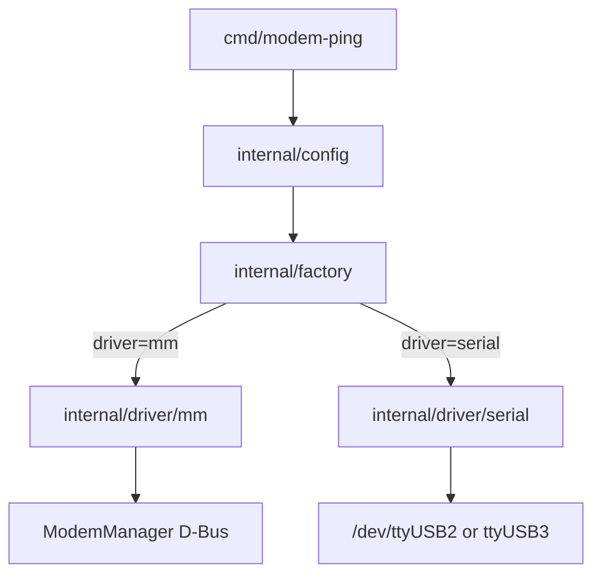

# SMS Gateway

SMS gateway for receiving SMS messages on Linux using a **Quectel EC25-EUX** LTE modem connected over USB.

The project uses a pluggable **driver** model to talk to the modem:

| Driver | Backend | Default |
|--------|---------|---------|
| **`mm`** | ModemManager over system D-Bus | **yes** |
| **`serial`** | Direct AT commands on `/dev/ttyUSB*` | no |

The first milestone is `modem-ping`: verify the selected driver can reach the EC25.

## Architecture



Both drivers implement `internal/modem.Modem` (`Ping`, `Close`).

## Hardware

| Component | Details |
|-----------|---------|
| Modem | Quectel EC25-EUX (USB VID `2c7c`, PID `0125`) |
| Connection | USB to host computer |
| SIM | Required for SMS later; **not** required for ping PoC |

Typical USB interfaces exposed by the EC25 on Linux:

| Device | Purpose |
|--------|---------|
| `/dev/ttyUSB0` | Diagnostic (DM) |
| `/dev/ttyUSB1` | GPS NMEA |
| `/dev/ttyUSB2` | AT commands (primary) |
| `/dev/ttyUSB3` | AT / PPP |
| `/dev/cdc-wdm*` | QMI |
| `wwan0` | Network interface |

## Configuration

Copy the example config:

```bash
cp config.example.yaml config.yaml
```

Example [`config.example.yaml`](config.example.yaml):

```yaml
driver: mm   # mm | serial

serial:
  device: auto
  baud_rate: 115200
  timeout: 2s

mm:
  modem_index: 0
  timeout: 5s
```

**Precedence** (highest wins): CLI flags → environment variables → YAML file → built-in defaults.

| Setting | YAML | Environment | CLI flag |
|---------|------|-------------|----------|
| Config file | — | `SMS_GATEWAY_CONFIG` | `-config` |
| Driver | `driver` | `SMS_GATEWAY_DRIVER` | `-driver` |
| Serial device | `serial.device` | `MODEM_DEVICE` | `-device` |
| Timeout | `serial.timeout` / `mm.timeout` | `MODEM_TIMEOUT` | `-timeout` |
| MM modem index | `mm.modem_index` | `MODEM_INDEX` | `-modem-index` |

Config search order: `-config` path → `./config.yaml` → `/etc/sms-gateway/config.yaml` (skipped if missing).

## Prerequisites

- Linux with Quectel USB drivers (`option`, `qmi_wwan`)
- Go **1.26** or newer
- **`mm` driver:** `ModemManager` running (`systemctl status ModemManager`)
- **`serial` driver:** user in `dialout` group

### Install Go 1.26

```bash
curl -fsSL -o /tmp/go1.26.0.linux-amd64.tar.gz https://go.dev/dl/go1.26.0.linux-amd64.tar.gz
mkdir -p ~/.local/go1.26 && tar -C ~/.local/go1.26 --strip-components=1 -xzf /tmp/go1.26.0.linux-amd64.tar.gz
export PATH=$HOME/.local/go1.26/bin:$PATH
go version
```

### Serial port permissions (serial driver only)

```bash
sudo usermod -aG dialout $USER
# log out and back in
```

## Quick start

```bash
# Ping the modem (default: ModemManager driver)
go run ./cmd/modem-ping

# Check SIM and SMS readiness
go run ./cmd/sms-status

# Verbose AT traffic on stderr (serial driver)
go run ./cmd/modem-ping -driver serial -verbose
go run ./cmd/sms-status -driver serial -verbose

# Env override
SMS_GATEWAY_DRIVER=serial go run ./cmd/modem-ping

# List serial ports
go run ./cmd/modem-ping -list-ports
```

Expected output (MM driver):

```
driver: mm
device: /org/freedesktop/ModemManager1/Modem/0
status: ok
detail: QUALCOMM INCORPORATED QUECTEL Mobile Broadband Module (IMEI ..., state ...)
```

Expected output (serial driver):

```
driver: serial
device: /dev/ttyUSB3
status: ok
detail: OK
```

Expected output (`sms-status`, MM driver):

```
driver: mm
device: /org/freedesktop/ModemManager1/Modem/0
sim: missing
modem: failed (sim-missing)
network: unavailable
messages: unknown
sms_ready: false
detail: sim=missing, modem=failed (sim-missing), network=unavailable
```

### Exit codes

| Code | Meaning |
|------|---------|
| 0 | Ping succeeded |
| 1 | Ping failed (modem error, timeout) |
| 2 | Setup failure (config, permissions, driver init) |

## Driver comparison

| | **mm** (default) | **serial** |
|--|------------------|------------|
| Best for | Headless Pi, desktop with MM | Dedicated gateway, full AT control |
| Permissions | D-Bus / polkit (usually works for session user) | `dialout` group |
| Port busy issue | No serial port opened | May need `auto` fallback or udev rule |
| Pi OS Bookworm | Works out of the box | Works with `dialout` |

## Troubleshooting

### MM driver: modem not found

- Check ModemManager: `systemctl status ModemManager`
- List modems: `mmcli -L`
- Try explicit path in config: `mm.modem_path: /org/freedesktop/ModemManager1/Modem/0`

### Serial driver: Serial port busy

ModemManager holds `/dev/ttyUSB2`. Use default `auto` device probing (tries `ttyUSB2` then `ttyUSB3`) or install the udev rule:

```bash
sudo cp deploy/udev/99-quectel-at.rules /etc/udev/rules.d/
sudo udevadm control --reload-rules && sudo udevadm trigger
```

Or use the **mm** driver (default) to avoid serial port contention entirely.

### SIM not detected (`sim-missing`)

Blocks SMS but not ping. Reseat the nano-SIM and check `mmcli -m 0 | grep -i sim`.

## Project layout

```
cmd/modem-ping/           Ping modem connectivity
cmd/sms-status/           SIM and SMS readiness status
internal/cmdutil/         Shared CLI flag helpers
internal/config/          YAML + env + flag loading
internal/modem/           Modem interface and types
internal/factory/           Driver factory
internal/driver/mm/         ModemManager D-Bus driver (Linux)
internal/driver/serial/     Direct AT serial driver
config.example.yaml       Example configuration
deploy/udev/              Optional udev rules for serial driver
```

## Roadmap

1. **PoC (current)** — driver-agnostic `modem-ping`
2. SIM readiness — `AT+CPIN?` / MM SIM status
3. SMS receive — serial URCs or MM Messaging D-Bus
4. SMS send — `AT+CMGS` or MM Messaging
5. HTTP/API gateway — expose SMS to other services

## License

Private project — license TBD.
