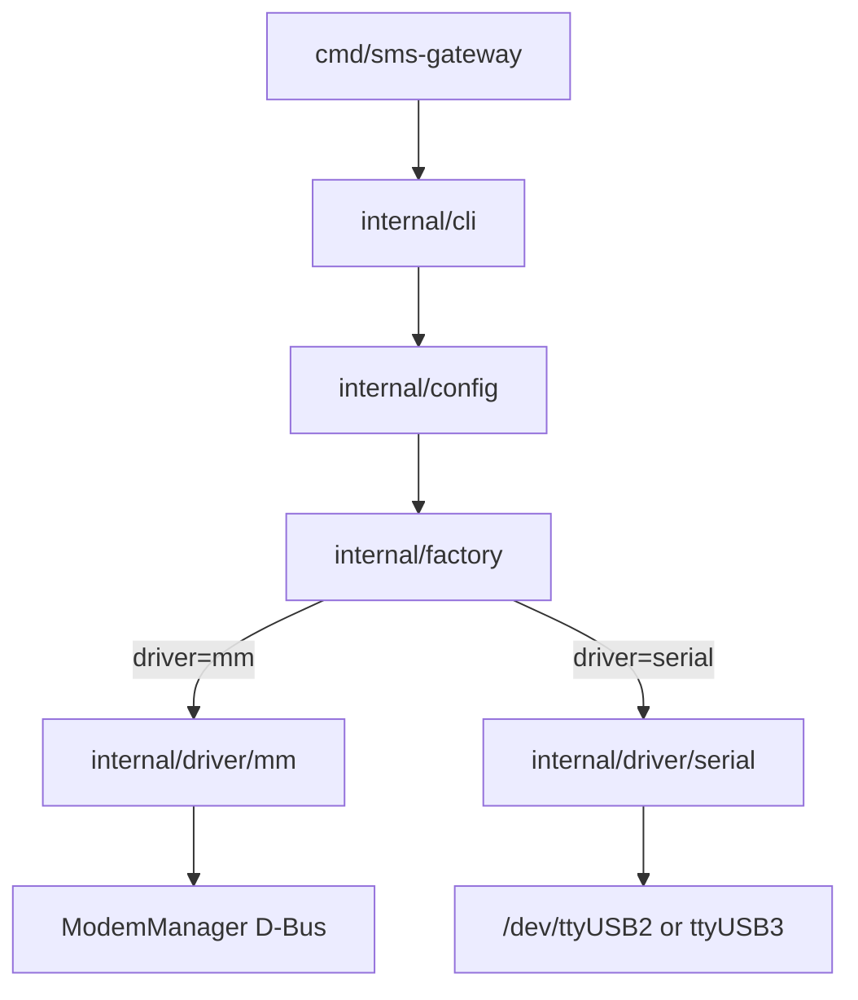

# SMS Gateway

SMS gateway for receiving SMS messages on Linux using a **Quectel EC25-EUX** LTE modem connected over USB.

Single static binary with subcommands — ideal for headless Raspberry Pi deployment.

```bash
go build -o bin/sms-gateway ./cmd/sms-gateway
./bin/sms-gateway ping
./bin/sms-gateway status
./bin/sms-gateway ports
```

The project uses a pluggable **driver** model to talk to the modem:

| Driver | Backend | Default |
|--------|---------|---------|
| **`mm`** | ModemManager over system D-Bus | **yes** |
| **`serial`** | Direct AT commands on `/dev/ttyUSB*` | no |

## Architecture



Both drivers implement `internal/modem.Modem` (`Ping`, `SMSStatus`, `Close`).

## Commands

| Command | Description |
|---------|-------------|
| `ping` | Check modem connectivity |
| `status` | Show SIM and SMS readiness |
| `messages` | List all SMS messages |
| `send` | Send an SMS (`--number`, `--text`) |
| `ports` | List detected serial ports |

Global flags (all subcommands):

```
--config string    Config file path
--driver string    Driver override: mm | serial
-v, --verbose      Verbose logging
```

Subcommand flags (`ping`, `status`):

```
--device string       Serial device (serial driver only)
--timeout duration    Command timeout
--modem-index int     ModemManager modem index (mm driver only)
```

## Hardware

| Component | Details |
|-----------|---------|
| Modem | Quectel EC25-EUX (USB VID `2c7c`, PID `0125`) |
| Connection | USB to host computer |
| SIM | Required for SMS later; **not** required for ping PoC |

Typical USB interfaces exposed by the EC25 on Linux:

| Device | Purpose |
|--------|---------|
| `/dev/ttyUSB0` | Diagnostic (DM) |
| `/dev/ttyUSB1` | GPS NMEA |
| `/dev/ttyUSB2` | AT commands (primary) |
| `/dev/ttyUSB3` | AT / PPP |
| `/dev/cdc-wdm*` | QMI |
| `wwan0` | Network interface |

## Configuration

Copy the example config:

```bash
cp config.example.yaml config.yaml
```

Example [`config.example.yaml`](config.example.yaml):

```yaml
driver: mm   # mm | serial

serial:
  device: auto
  baud_rate: 115200
  timeout: 2s

mm:
  modem_index: 0
  timeout: 5s
```

**Precedence** (highest wins): CLI flags → environment variables → YAML file → built-in defaults.

| Setting | YAML | Environment | CLI flag |
|---------|------|-------------|----------|
| Config file | — | `SMS_GATEWAY_CONFIG` | `--config` |
| Driver | `driver` | `SMS_GATEWAY_DRIVER` | `--driver` |
| Serial device | `serial.device` | `MODEM_DEVICE` | `--device` |
| Timeout | `serial.timeout` / `mm.timeout` | `MODEM_TIMEOUT` | `--timeout` |
| MM modem index | `mm.modem_index` | `MODEM_INDEX` | `--modem-index` |

Config search order: `--config` path → `./config.yaml` → `/etc/sms-gateway/config.yaml` (skipped if missing).

## Prerequisites

- Linux with Quectel USB drivers (`option`, `qmi_wwan`)
- Go **1.26** or newer
- **`mm` driver:** `ModemManager` running (`systemctl status ModemManager`)
- **`serial` driver:** user in `dialout` group

### Install Go 1.26

```bash
curl -fsSL -o /tmp/go1.26.0.linux-amd64.tar.gz https://go.dev/dl/go1.26.0.linux-amd64.tar.gz
mkdir -p ~/.local/go1.26 && tar -C ~/.local/go1.26 --strip-components=1 -xzf /tmp/go1.26.0.linux-amd64.tar.gz
export PATH=$HOME/.local/go1.26/bin:$PATH
go version
```

### Serial port permissions (serial driver only)

```bash
sudo usermod -aG dialout $USER
# log out and back in
```

## Quick start

```bash
# Build
go build -o bin/sms-gateway ./cmd/sms-gateway

# Ping modem (default: ModemManager driver)
./bin/sms-gateway ping

# Check SIM and SMS readiness
./bin/sms-gateway status

# List all SMS messages
./bin/sms-gateway messages

# Send an SMS
./bin/sms-gateway send --number +1234567890 --text "Hello"

# Serial AT driver with verbose logging
./bin/sms-gateway --driver serial ping -v

# Env override
SMS_GATEWAY_DRIVER=serial ./bin/sms-gateway ping

# List serial ports
./bin/sms-gateway ports

# Help
./bin/sms-gateway --help
./bin/sms-gateway ping --help
```

Development without installing:

```bash
go run ./cmd/sms-gateway ping
go run ./cmd/sms-gateway status
```

Expected output (`ping`, MM driver):

```
driver: mm
device: /org/freedesktop/ModemManager1/Modem/0
status: ok
detail: QUALCOMM INCORPORATED QUECTEL Mobile Broadband Module (IMEI ..., state ...)
```

Expected output (`status`, MM driver):

```
driver: mm
device: /org/freedesktop/ModemManager1/Modem/0
sim: missing
modem: failed (sim-missing)
network: unavailable
messages: unknown
sms_ready: false
detail: sim=missing, modem=failed (sim-missing), network=unavailable
```

### Exit codes

| Code | Meaning |
|------|---------|
| 0 | Command succeeded |
| 1 | Modem operation failed |
| 2 | Setup failure (config, permissions, driver init) |

## Driver comparison

| | **mm** (default) | **serial** |
|--|------------------|------------|
| Best for | Headless Pi, desktop with MM | Dedicated gateway, full AT control |
| Permissions | D-Bus / polkit (usually works for session user) | `dialout` group |
| Port busy issue | No serial port opened | May need `auto` fallback or udev rule |
| Pi OS Bookworm | Works out of the box | Works with `dialout` |

## Troubleshooting

### MM driver: modem not found

- Check ModemManager: `systemctl status ModemManager`
- List modems: `mmcli -L`
- Try explicit path in config: `mm.modem_path: /org/freedesktop/ModemManager1/Modem/0`

### Serial driver: Serial port busy

ModemManager holds `/dev/ttyUSB2`. Use default `auto` device probing (tries `ttyUSB2` then `ttyUSB3`) or install the udev rule:

```bash
sudo cp deploy/udev/99-quectel-at.rules /etc/udev/rules.d/
sudo udevadm control --reload-rules && sudo udevadm trigger
```

Or use the **mm** driver (default) to avoid serial port contention entirely.

### SIM not detected (`sim-missing`)

Blocks SMS but not ping. Reseat the nano-SIM and check `mmcli -m 0 | grep -i sim`.

## Project layout

```
cmd/sms-gateway/          Single binary entrypoint
internal/cli/             Cobra commands (ping, status, messages, send, ports)
internal/cmdutil/         Shared flags and modem helpers
internal/config/          YAML + env + flag loading
internal/modem/           Modem interface and types
internal/factory/         Driver factory
internal/driver/mm/       ModemManager D-Bus driver (Linux)
internal/driver/serial/   Direct AT serial driver
config.example.yaml       Example configuration
deploy/udev/              Optional udev rules for serial driver
```

## Roadmap

1. **PoC (current)** — `sms-gateway ping` and `sms-gateway status`
2. SMS receive — serial URCs or MM Messaging D-Bus
3. SMS send — `AT+CMGS` or MM Messaging
4. HTTP/API gateway — expose SMS to other services
5. systemd unit — run as a service on Pi

## License

Private project — license TBD.
